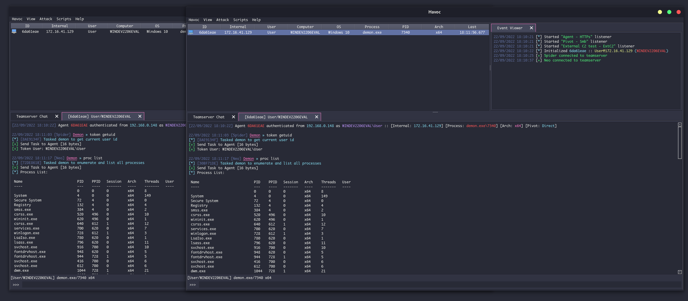
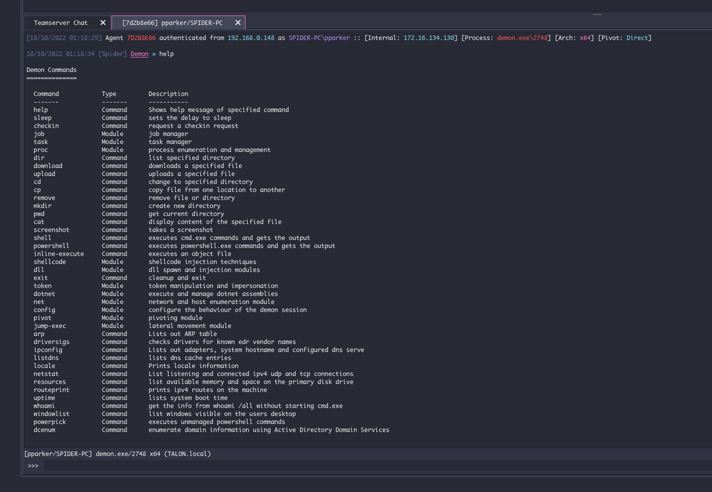

  
  <h1>Phantom-Operator</h1>
   

  
<i>Phantom-Operator is a modern and malleable post-exploitation command and control framework, created by <a href="https://twitter.com/C5pider">@C5pider</a>.</i>

   

   
   
  

### Quick Start

> Please see the [Wiki](https://github.com/Gareen/Phantom-Operator/wiki) for complete documentation.

Phantom-Operator works well on Debian 10/11, Ubuntu 20.04/22.04 and Kali Linux. It's recommended to use the latest versions possible to avoid issues. You'll need a modern version of Qt and Python 3.10.x to avoid build issues.

See the [Installation](https://havocframework.com/docs/installation) docs for instructions. If you run into issues, check the [Known Issues](https://github.com/Gareen/Phantom-Operator/wiki#known-issues) page as well as the open/closed [Issues](https://github.com/Gareen/Phantom-Operator/issues) list.

---

### Features

#### Client

> Cross-platform UI written in C++ and Qt

- Modern, dark theme based on [Dracula](https://draculatheme.com/)

#### Teamserver

> Written in Golang

- Multiplayer
- Payload generation (exe/shellcode/dll)
- HTTP/HTTPS listeners
- Customizable C2 profiles 
- External C2

#### Demon

> Phantom-Operator's flagship agent written in C and ASM

- Sleep Obfuscation via [Ekko](https://github.com/Cracked5pider/Ekko), Ziliean or [FOLIAGE](https://github.com/SecIdiot/FOLIAGE)
- x64 return address spoofing
- Indirect Syscalls for Nt* APIs
- SMB support
- Token vault
- Variety of built-in post-exploitation commands
- Patching Amsi/Etw via Hardware breakpoints
- Proxy library loading
- Stack duplication during sleep. 

   

#### Extensibility

- [External C2](https://github.com/Gareen/Phantom-Operator/wiki#external-c2)
- Custom Agent Support
  - [Talon](https://github.com/Gareen/Talon)
- [Python API](https://github.com/Gareen/havoc-py)
- [Modules](https://github.com/Gareen/Modules)

---

### Community

You can join the official [Phantom-Operator Discord](https://discord.gg/z3PF3NRDE5) to chat with the community! 

### Note

Please do not open any issues regarding detection. 

The Phantom-Operator Framework hasn't been developed to be evasive. Rather it has been designed to be as malleable & modular as possible. Giving the operator the capability to add custom features or modules that evades their targets detection system. 
